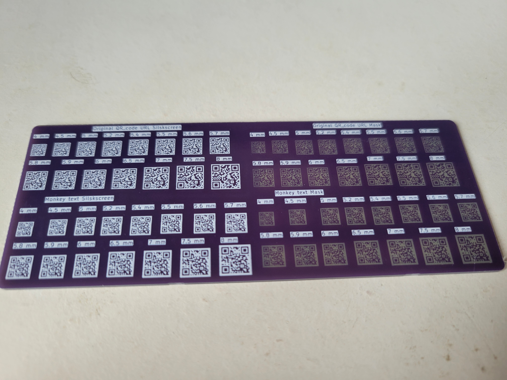
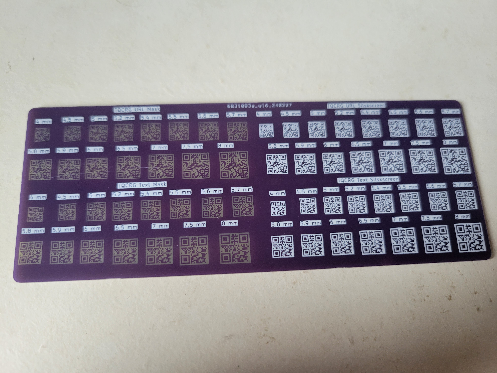

# QR Code Tester

# Summary of the project

The goal of this board was to approximate the minimum size in which you can reliably scan the QR code of a website link printed on the silkscreen or the mask layer.

## Features
- size from 8 mm down to 4 mm
- 4 differents QR Code (same URL but different qr code generator or parameters)
- printed on both silkscreen and mask layer

## Board results :

## Scanning results :

The QR codes work down to 4 mm with the default camera app of a Samsung S21 or with a simple scanner app. No difference were seen in precision between silkscreen and mask layer.
